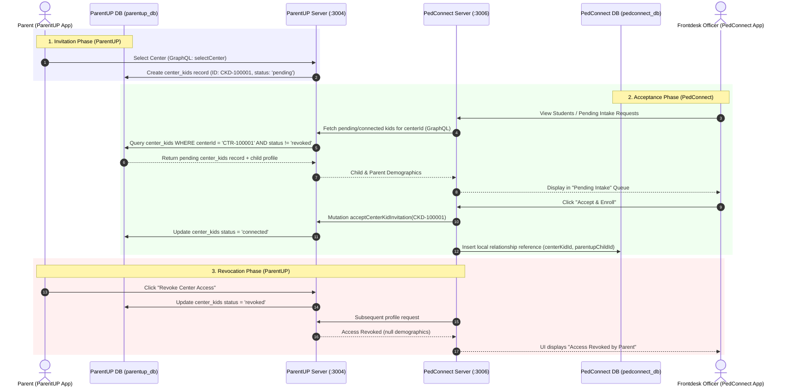

# ParentUP & PedConnect Student Profile Integration Architecture

This document describes the cross-service student profile integration between **ParentUP** (Parent Mobile App & Backend), **PedConnect** (Isolated White-Labeled Therapy Center Web Dashboard & Backend), and **Core** (Central Master Directory of Centers).

## Architecture Overview

- **Core Master Directory (`core_db.centers`)**: Stores the central catalog of onboarded therapy centers (`_id: 'CTR-100001'`, `name`, `slug`, `address`, `logoUri`). ParentUP queries Core to display the center catalog to parents.
- **ParentUP Database (`parentup_db`)**: Stores family profiles, master child demographic records (`kids`), and parent-controlled center connection links (`center_kids`).
- **PedConnect Center Instance (`pedconnect_db`)**: Each therapy center runs its own white-labeled Docker container instance configured via environment variable `CENTER_ID="CTR-100001"`, storing center-specific operational student metadata (`students`), programs, and session schedules.




---

## Identifier Conventions
- **Internal Database Linking**: Standard native MongoDB IDs (`_id`) are used for database indexes and primary key/foreign key relations.
- **Universal Public Identifier (`publicId`)**: ParentUP assigns explicit child and connection public IDs such as `CHD-100001` and `CKD-100001`. Pedconnect resolves the child's public ID live from ParentUP; its local student relationship uses an internal UUID plus ParentUP references.

| Entity | Prefix | Example `publicId` | Internal `_id` | Database |
| :--- | :--- | :--- | :--- | :--- |
| Child Profile | `CHD` | `CHD-100001` | MongoDB ObjectId / UUID | `parentup_db` |
| Center Kid Connection | `CKD` | `CKD-100001` | MongoDB ObjectId / UUID | `parentup_db` |
| Local Center Student Reference | — | Uses child `CHD` public ID when resolved | UUID | `pedconnect_db` |
| Center / Branch | `CTR` | `CTR-100001` | MongoDB ObjectId / UUID | `pedconnect_db` |


---

## Data Models & Schemas

### 1. ParentUP Collections (`parentup_db`)

#### `center_kids` Collection
Junction document managed directly by the parent to grant, confirm, or revoke center access to a child's profile.
```typescript
export interface DbCenterKid {
  _id: ObjectId;
  publicId: string;         // e.g., 'CKD-100001'
  centerId: string;         // e.g., 'CTR-100001'
  kidId: ObjectId;          // Points to kids._id
  parentId: ObjectId;       // Points to parents._id
  status: 'pending' | 'connected' | 'revoked';
  invitedAt: Date;
  connectedAt?: Date | null;
  revokedAt?: Date | null;
  createdAt: Date;
  updatedAt: Date;
}
```

#### `kids` Collection
Master demographic record maintained by the parent in ParentUP.
```typescript
export interface DbKid {
  _id: ObjectId;
  publicId: string;         // e.g., 'CHD-100001'
  firstName: string;
  lastName: string;
  nickname?: string | null;
  dob: string;
  gender: string;
  nationality?: string | null;
  language?: string | null;
  address?: string | null;
  phone?: string | null;
  email?: string | null;
  photoUri?: string | null;
  createdAt: Date;
  updatedAt: Date;
}
```

#### `parents` Collection
ParentUP people who are authorized to manage family and child profiles. A parent can
exist without a ParentUP account; account-backed parents reference Better Auth.
```typescript
export interface DbParent {
  _id: ObjectId;
  publicId: string;         // e.g., 'PAR-100001'
  userId?: ObjectId | null; // Points to Better Auth auth_users._id
  firstName: string;
  lastName: string;
  name: string;
  phone?: string | null;
  email?: string | null;
  createdAt: Date;
  updatedAt: Date;
}
```

#### `parent_kids` Collection
Child-specific parent relationships. Keeping this separate allows one parent profile
to manage multiple children.
```typescript
export interface DbParentKid {
  _id: ObjectId;
  parentId: ObjectId;       // Points to parents._id
  kidId: ObjectId;          // Points to kids._id
  relationship: string;
  isPrimaryContact: boolean;
  createdAt: Date;
  updatedAt: Date;
}
```

#### `families` Collection
The ParentUP family record. `organizationId` links an account-backed family to the
corresponding Better Auth organization.
```typescript
export interface DbFamily {
  _id: ObjectId;
  publicId: string;         // e.g., 'FAM-100001'
  organizationId?: ObjectId | null;
  name: string;
  slug: string;
  logo?: string | null;
  values: string[];
  mission?: string | null;
  createdAt: Date;
  updatedAt: Date;
}
```

#### `family_parents` Collection
Every ParentUP parent belongs to a family through an explicit membership record.
```typescript
export interface DbFamilyParent {
  _id: ObjectId;
  familyId: ObjectId;       // Points to families._id
  parentId: ObjectId;       // Points to parents._id
  role: 'owner' | 'organizer' | 'member';
  createdAt: Date;
  updatedAt: Date;
}
```

#### `family_kids` Collection
Children belong to families through a junction record rather than a direct parent
field. This supports multi-child, blended, and shared-custody families.
```typescript
export interface DbFamilyKid {
  _id: ObjectId;
  familyId: ObjectId;       // Points to families._id
  kidId: ObjectId;          // Points to kids._id
  status: 'active' | 'pending' | 'removed';
  createdAt: Date;
  updatedAt: Date;
}
```

Parent access to a child is authorized through `family_parents -> families ->
family_kids`. The `parent_kids` collection stores relationship metadata only;
it is not an authorization boundary.

---

### 2. PedConnect Collections (`pedconnect_db`)

#### `students` Collection
Local center-specific operational metadata. Holds references to ParentUP IDs (`centerKidId` and `parentupChildId`).
```typescript
export interface DbStudent {
  _id: string;              // Pedconnect-local UUID
  centerId: string;         // Pedconnect organization ID
  centerKidId: string;      // Points to 'CKD-100001' in parentup_db
  parentupChildId: string;  // Points to 'CHD-100001' in parentup_db
  status: 'Active' | 'Inactive' | 'Pending';
  enrollmentDate: string;
  programManagerId?: string | null;
  createdAt: Date;
  updatedAt: Date;
}
```

---

## Service API Integration Specifications

### 1. ParentUP GraphQL API
- Parent-owned operations require a Better Auth session.
- PediaConnect operations require the shared `PARENTUP_API_KEY` in `x-api-key`.
- `selectCenter(centerId: ID!, childId: ID!): CenterKid!`
  - Creates a new `center_kids` document in `parentup_db` with `status: 'pending'`.
- `acceptCenterKidInvitation(centerKidId: ID!, centerId: ID!): CenterKid!`
  - Updates `center_kids.status` to `'connected'`.
- `revokeCenterKidAccess(centerKidId: ID!): CenterKid!`
  - Updates `center_kids.status` to `'revoked'`.
- `Query.connectedCenterKids(centerId: ID!, status: String): [CenterKid!]!`
  - Returns authorized child and family demographic records for the requesting center ID.

### 2. PedConnect GraphQL API
- `Query.students(status: StudentStatus): [Student!]!`
  - Resolves accepted local relationship references and joins live demographics from ParentUP.
- `Query.pendingStudentInvitations: [PendingStudentInvitation!]!`
  - Fetches pending ParentUP connections and their live guardian and child demographics.
- `Mutation.acceptInvitation(centerKidId: ID!, programManagerId: ID): Student!`
  - Invokes `acceptCenterKidInvitation` on ParentUP Server and creates the local `pedconnect_db.students` operational record.
